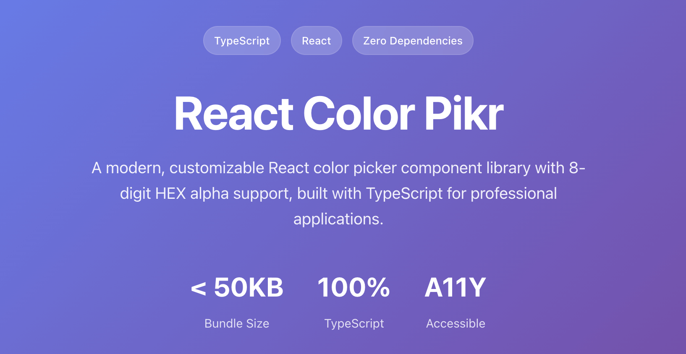

# React Color Pikr 🎨



> A modern, accessible, and feature-rich React color picker component library with comprehensive alpha channel support

[](https://badge.fury.io/js/react-color-pikr)
[](https://opensource.org/licenses/MIT)
[](https://www.typescriptlang.org/)
[](https://bundlephobia.com/package/react-color-pikr)
[](https://www.npmjs.com/package/react-color-pikr)

**[🚀 Live Demo](https://ssunils.github.io/react-color-pikr)** | **[📚 Documentation](https://github.com/ssunils/react-color-pikr/tree/main/docs)** | **[📦 npm Package](https://www.npmjs.com/package/react-color-pikr)**

## ✨ Why React Color Pikr?

React Color Pikr stands out as the most comprehensive color picker solution for modern React applications. Unlike other libraries, it provides **native 8-digit HEX alpha support**, **zero external dependencies**, and **built-in accessibility features**.

### 🎯 Perfect For
- **Design Systems**: Integrate seamlessly with your design system
- **Content Management**: Rich color selection for CMS interfaces  
- **Creative Applications**: Professional-grade color tools
- **Mobile Applications**: Touch-optimized for mobile-first design
- **Accessibility-First Projects**: WCAG 2.1 compliant out of the box

## 🚀 Features

### 🎨 **Advanced Color Support**
- **8-Digit HEX Alpha**: Full transparency control with #RRGGBBAA format
- **Multiple Formats**: HEX, RGB, HSV, and HSL with seamless conversion
- **Precision Control**: High-resolution color selection and alpha blending
- **Real-time Preview**: Instant visual feedback with alpha transparency

### ♿ **Accessibility Excellence**
- **Keyboard Navigation**: Full keyboard support with intuitive controls
- **Screen Reader**: ARIA labels and announcements for all interactions
- **High Contrast**: Optimized focus indicators and visual cues
- **Touch Accessibility**: 44px minimum touch targets for mobile users

### 📱 **Mobile-First Design**
- **Touch Optimized**: Smooth gesture handling and responsive interactions
- **Cross-Platform**: Works flawlessly on iOS, Android, and desktop
- **Performance**: 60fps interactions with optimized rendering

### 🛠 **Developer Experience**
- **TypeScript First**: Complete type definitions and IntelliSense support
- **Zero Dependencies**: Lightweight bundle with no external requirements
- **Framework Agnostic**: Easy integration with any React application
- **Customizable**: Extensive theming and styling options

## Installation

```bash
npm install react-color-pikr
```

```bash
yarn add react-color-pikr
```

```bash
pnpm add react-color-pikr
```

## Quick Start

```tsx
import React, { useState } from 'react';
import { ColorPicker } from 'react-color-pikr';

function App() {
  const [color, setColor] = useState('#3498db80'); // 8-digit HEX with alpha

  return (
    <ColorPicker
      value={color}
      onChange={setColor}
      format="hex"
      showAlpha={true}
      showPresets={true}
    />
  );
}
```

> **Note**: No CSS imports required! All styles are included automatically.

## Documentation

| Guide | Description |
|-------|-------------|
| **[Getting Started](./docs/GETTING_STARTED.md)** | Installation, setup, and basic usage |
| **[API Reference](./docs/API.md)** | Complete component and utility documentation |
| **[Examples](./docs/EXAMPLES.md)** | Real-world usage examples and patterns |
| **[Customization](./docs/CUSTOMIZATION.md)** | Advanced styling and theming guide |
| **[Migration Guide](./docs/MIGRATION.md)** | Migrate from other color picker libraries |

## Quick Examples

### Basic Usage
```tsx
const [color, setColor] = useState('#ff6b6b');
return <ColorPicker value={color} onChange={setColor} />;
```

### With Alpha Channel
```tsx
<ColorPicker 
  value="#3498db80" 
  onChange={setColor} 
  showAlpha={true} 
  format="hex" 
/>
```

### Custom Presets
```tsx
const presets = ['#e74c3c', '#3498db', '#2ecc71', '#f39c12'];
<ColorPicker 
  value={color} 
  onChange={setColor} 
  presetColors={presets} 
/>
```

### Multiple Formats
```tsx
<ColorPicker 
  value={color} 
  onChange={setColor} 
  format="rgb" // Returns: rgba(52, 152, 219, 0.8)
  showColorFormat={true}
/>
```

## Key Props

| Prop | Type | Default | Description |
|------|------|---------|-------------|
| `value` | `string` | `#FF0000` | Current color value |
| `onChange` | `(color: string) => void` | - | Color change callback |
| `format` | `'hex' \| 'rgb' \| 'hsv' \| 'hsl'` | `'hex'` | Output format |
| `showAlpha` | `boolean` | `false` | Enable alpha channel |
| `showPresets` | `boolean` | `true` | Show preset colors |
| `width` | `number` | `280` | Picker width |
| `height` | `number` | `200` | Picker height |

[**→ See complete API reference**](./docs/API.md)

## Why Choose React Color Pikr?

### vs. react-color (deprecated)
- **50% smaller bundle** (15KB vs 30KB+)
- **No CSS imports** required
- **Better TypeScript** support
- **Active maintenance** and updates
- **Better alpha support** with 8-digit HEX

### vs. react-colorful
- **More features** (presets, format selector, alpha)
- **Better accessibility** 
- **TypeScript included**
- **Customizable** sizing and styling

### vs. @uiw/react-color
- **Simpler API** with consistent return values
- **Better mobile** support
- **No CSS conflicts** with inline styles

[**→ See migration guide**](./docs/MIGRATION.md)

## Browser Support

- Chrome 60+
- Firefox 55+  
- Safari 12+
- Edge 79+
- Mobile browsers

## Contributing

Contributions are welcome! Please read our [Contributing Guide](.github/CONTRIBUTING.md) for details.

### Development Setup

```bash
# Clone repository
git clone https://github.com/ssunils/react-color-pikr.git

# Install dependencies
npm install

# Start development server
npm run dev

# Build library
npm run build:lib

# Validate before release
npm run validate-release
```

### Release Process

```bash
# Create releases using GitHub Actions (recommended)
# Go to Actions → Release → Run workflow

# Or use npm scripts
npm run release:patch  # Bug fixes
npm run release:minor  # New features  
npm run release:major  # Breaking changes
npm run release:beta   # Prerelease
```

## License

MIT © [Sunil Soundarapandian](https://github.com/ssunils)

## Support

- **[Report Issues](https://github.com/ssunils/react-color-pikr/issues)**
- **[Discussions](https://github.com/ssunils/react-color-pikr/discussions)**
- **Email**: sunil.soundarapandian@gmail.com

---

**Star this repo** if React Color Pikr helped you build something awesome!
